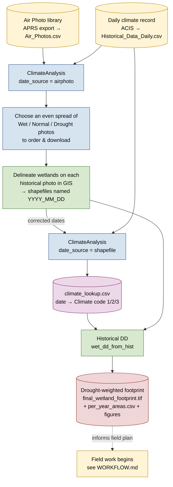

# Desktop Workflow — historical delineation before field work

This document describes the **desktop phase** of a wetland assessment: everything that happens *before* a crew sets foot on site. The goal of this phase is to produce a defensible historical wetland footprint from air photos and climate data, so that field work (vegetation, soils, water) can be planned against a known set of wetlands.

It is the front half of the story that [`WORKFLOW.md`](WORKFLOW.md) picks up: that document begins at **field data capture** and runs through to the client report. This one runs from the air photo order to the drought-weighted footprint that the report is built around.

> **Two tools, one workflow.** The desktop phase currently lives in two standalone repositories that are run in sequence:
>
> | Tool | Repo | Role |
> |---|---|---|
> | **ClimateAnalysis** | [`WetlandAerialClimate`](https://github.com/GreenPlanEdm/WetlandAerialClimate) | Classifies each air-photo date as Wet / Normal / Drought (SPEI) and exports `climate_lookup.csv`. |
> | **Historical DD** | [`wet_dd_from_hist`](https://github.com/GreenPlanEdm/wet_dd_from_hist) | Stacks the per-year delineations, weights them by climate, and produces a single drought-weighted footprint. |
>
> Both are expected to **fold into `wetland-tools` as package modules** eventually (e.g. `analysis/climate/`, `analysis/historical/`), following the same 4-step `0*.Rmd` pattern as the field modules. This doc lives here now so the big picture sits alongside the field-phase workflow it feeds.

---

## End-to-end data flow



---

## Stages

### 1. Get the air photo list

**Tool:** none (manual export).
**Output:** `Air_Photos.csv`.

Export the flight records for the site's Township/Range/Meridian from the Alberta Provincial Remote Sensing (APRS) archive. The only column the workflow needs is `flown_date`; the rest of the metadata is carried along for reference.

> The library sometimes records a **placeholder** date for a flight (e.g. `YYYY-01-01`). That's fine at this stage — it gets corrected in stage 3.

### 2. Run ClimateAnalysis on the air photo list (selection pass)

**Tool:** `WetlandAerialClimate`, `date_source: "airphoto"`.
**Inputs:** `Air_Photos.csv`, `Historical_Data_Daily.csv` (daily ACIS climate record).
**Output:** PDF report classifying every available photo date as **Wet / Normal / Drought** via the one-year SPEI.

Use the report to **choose which photos to order** — aim for an even spread of drought, normal, and wet conditions so the historical footprint isn't biased toward one climate regime. SPEI is calculated for every day in the climate record; this pass simply reads it out at the air-photo dates.

### 3. Delineate wetlands on the historical imagery

**Tool:** GIS (manual), outside both repos.
**Output:** one delineation **shapefile per photo year**, each named starting with the photo date as `YYYY_MM_DD ...` (or `YYYY-M-D ...`).

This is where placeholder dates get fixed: once the photo is downloaded, the **true flown date is printed on the edge of the image**. The delineator captures that corrected date in the shapefile name. From here on, **the shapefile names are the authoritative dates.**

### 4. Re-run ClimateAnalysis on the shapefile dates (finalize pass)

**Tool:** `WetlandAerialClimate`, `date_source: "shapefile"`, `shapefile_dir` pointed at the delineations folder.
**Inputs:** the delineation shapefiles, `Historical_Data_Daily.csv`.
**Output:** `climate_lookup.csv` — one row per delineation date: `date`, `spei365`, `climatic_year`, and the numeric `climate` code.

The script ignores `Air_Photos.csv` this time and reads the corrected dates from the shapefile filenames, so every delineation gets a Climate code and the lookup lines up exactly with the dates the next tool will parse. Set `climate_lookup_file` to write directly into the delineations folder (the `shp_dir` that `wet_dd_from_hist` reads).

### 5. Build the drought-weighted footprint for the report

**Tool:** `wet_dd_from_hist`.
**Inputs:** the delineation shapefiles (`shp_dir`), `climate_lookup.csv`.
**Output:** `final_wetland_footprint.tif`, `per_year_areas.csv`, and publication figures.

Each year's delineation is rasterized and assigned its Climate code from the lookup (matched on the filename date). The years are stacked and weighted so the footprint is **conservative but defensible** — resilient wetlands that persist across dry years carry more weight than transient wet-year inundation. This footprint, alongside the historical imagery, is what the desktop-delineation report is built on.

After this, field work begins — see [`WORKFLOW.md`](WORKFLOW.md).

---

## The handoff: `climate_lookup.csv`

`climate_lookup.csv` is the single artifact passed from ClimateAnalysis (stage 4) to Historical DD (stage 5):

| Column | Description |
|---|---|
| `date` | Delineation date (YYYY-MM-DD), matching the shapefile filename |
| `spei365` | One-year SPEI at that date |
| `climatic_year` | Wet Year / Normal Year / Drought Year / No Data |
| `climate` | Numeric code: **1 = Wet, 2 = Normal, 3 = Drought** (`NA` = No Data) |

`wet_dd_from_hist` expects this file inside its `shp_dir`. Point `WetlandAerialClimate`'s `climate_lookup_file` param at that folder so the file lands where the next tool looks for it — no manual copy.

---

## The contract between the two tools

Two conventions **must stay identical** across the repos, or the tools silently disagree:

1. **The filename date pattern.** Both tools parse the delineation date with the same regex — `\d{4}[_-]\d{1,2}[_-]\d{1,2}` — then pad to `YYYY-MM-DD`. If one tool's pattern changes (e.g. to accept `YYYYMMDD`), dates stop matching and delineations fall out of the climate weighting.
2. **The Climate codes.** `1 = Wet, 2 = Normal, 3 = Drought`, with `NA`/No Data for dates outside the climate record. ClimateAnalysis writes them; Historical DD reads them.

> This duplicated date-parsing logic is the strongest argument for eventually merging both tools into `wetland-tools`, where the regex would live in **one shared `R/` function** instead of two copies kept in sync by hand. A mismatch here is exactly the kind of failure that shows up as "half the delineations are Unknown."

---

## Where things live (desktop phase)

| Item | Produced by | Consumed by |
|---|---|---|
| `Air_Photos.csv` | APRS export (manual) | ClimateAnalysis (airphoto pass) |
| `Historical_Data_Daily.csv` | ACIS export (manual) | ClimateAnalysis (both passes) |
| ClimateAnalysis PDF report | ClimateAnalysis (airphoto pass) | Analyst — photo selection |
| Delineation shapefiles (`YYYY_MM_DD ...`) | GIS (manual) | ClimateAnalysis (shapefile pass), Historical DD |
| `climate_lookup.csv` | ClimateAnalysis (shapefile pass) | Historical DD |
| `final_wetland_footprint.tif` + figures | Historical DD | Desktop delineation report → field planning |

---

## Quick reference — params to set per tool

**ClimateAnalysis (`Climate_Analysis_5.1.Rmd`)**

```yaml
# Pass 1 — selection
date_source: "airphoto"
air_photo_file: ".../Air_Photos.csv"

# Pass 2 — finalize (after delineation)
date_source: "shapefile"
shapefile_dir: ".../Historical delineations"
climate_lookup_file: ".../Historical delineations/climate_lookup.csv"  # inside shp_dir
```

**Historical DD (`Final_DD_from_Historical_v1.1.Rmd`)**

```yaml
shp_dir: ".../Historical delineations"
climate_lookup_file: "climate_lookup.csv"   # bare name → resolved inside shp_dir
climate_col: "Climate"
```
