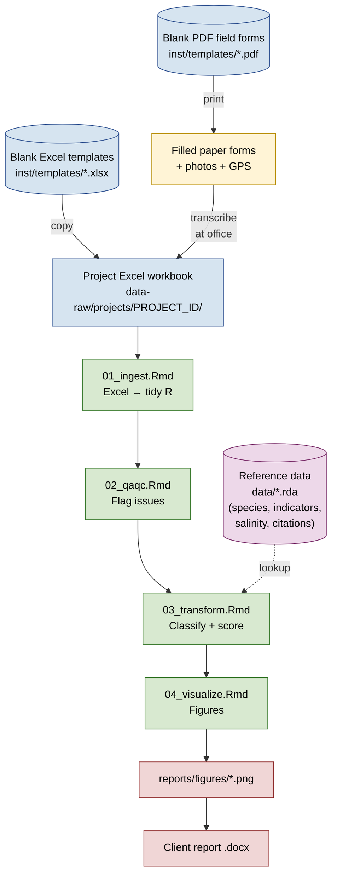
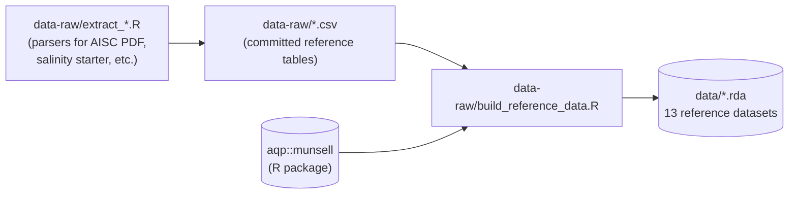

# Workflow — from field form to client report

This document walks through how a single plot's worth of field data moves through `wetland-tools`, from the paper form an ecologist carries into the field to the figures that land in a client deliverable. Use it to onboard new analysts, brief field crews on what the office side does with their data, or audit the pipeline before a regulator-facing report.

The package is built around three principles:

1. **Standardised forms and templates** so every project's data lands in the same shape.
2. **Parameterised analysis Rmds** so the same scripts run on every project without code edits — only `params$project_id` (and a few file paths) change.
3. **Reference data + a bibliography** that make every classification call traceable back to a published source.

---

## End-to-end data flow



The pipeline is run once per project. Reference data is built once per package release (or whenever the underlying CSVs change) and is read from `data/` by every project.

---

## Stages

### 1. Field data capture

**Where it happens:** in the field, on paper.
**Inputs:** blank PDF forms from `inst/templates/`.
**Outputs:** filled paper forms, geotagged photos, GPS coordinates.

The package ships two field forms:

- `inst/templates/vegetation_hydrology_field_form.pdf` — one per plot. Records species observations (code, name, stratum, % cover, wetland indicator status, invasive flag), in-situ water chemistry (pH / EC / ppm / temp), inundation / saturation indicators, ecosite classification, and a wetland-indicator-region call.
- `inst/templates/soils_field_form.pdf` — one per pit / probe. Records up to 15 soil horizons with depth, Munsell hue/value/chroma, texture, structure, Von Post, coarse fragments, mottles, plus physiogeography and a hydric soil summary.

Both forms are landscape letter, fillable, and styled so they print cleanly. Crews keep one copy per plot, geotagged photos go on the tablet, and the entire packet returns to the office at the end of the day.

> The forms are generated by `inst/templates/create_forms.py` (run once per layout revision; rebuilds both PDFs in place).

### 2. Office data entry

**Where it happens:** at the office, in Excel.
**Inputs:** filled paper forms.
**Outputs:** project-specific Excel workbook in `data-raw/projects/<PROJECT_ID>/`.

The package ships two blank Excel templates:

- `inst/templates/vegetation_hydrology_data_entry.xlsx`
- `inst/templates/soils_data_entry.xlsx`

A new project starts by **copying** the relevant template(s) into `data-raw/projects/<PROJECT_ID>/` (gitignored — client data never lands in the public repo). Each workbook has multiple sheets (`plots`, `species`, etc.) with data validation on key columns (datum, outlet, structural stage, invasive Y/N, etc.) to keep transcription tight.

> The Excel templates are generated by `inst/templates/create_excel_template.R` and `inst/templates/create_soils_template.R`. Re-run those scripts only when the underlying schema changes (e.g. adding or removing a column).

### 3. `01_ingest.Rmd` — read Excel into tidy R

**Inputs:** project Excel workbook(s).
**Outputs:** `data-raw/projects/<PROJECT_ID>/<PROJECT_ID>_<module>_raw.rds`.

The ingest step reads each Excel sheet via `readxl`, normalises column names with `janitor::clean_names()`, coerces types, and saves a project-scoped `.rds` snapshot. No data transformations happen here — the goal is "Excel in, tidy R data frame out, no surprises."

Each module (`analysis/vegetation/`, `analysis/soils/`, `analysis/water/`) has its own `01_ingest.Rmd`. They're parameterised:

```yaml
---
params:
  project_id: "BD2025.042"
  input_file: "vegetation_hydrology_data_entry.xlsx"
---
```

so running the same Rmd on a new project means only changing the params block (or passing them at render time).

### 4. `02_qaqc.Rmd` — flag issues before classification

**Inputs:** the `_raw.rds` from step 3.
**Outputs:** `_clean.rds` (validated data) + `_flags.csv` (issues found).

QA/QC checks the most common transcription and identification problems:

- Unrecognised species codes (not in `awcs_wetland_species` or `anpc_wetland_species`)
- Out-of-range numerics (`pct_cover` > 100, `hydro_ph` outside 0–14, `water_depth_cm` < 0, etc.)
- Missing required fields (no `plot_id`, no `date`)
- Inconsistent `date_of_assessment` ↔ `year` columns
- Suspicious `wetland_class` × `vegetation_class` combinations

Flagged rows are written to a CSV alongside the cleaned data so reviewers can chase down issues without having to re-run the full pipeline.

### 5. `03_transform.Rmd` — classify and score

**Inputs:** the `_clean.rds` from step 4, plus reference data from `data/*.rda`.
**Outputs:** per-plot and per-wetland summaries (`_summary.rds`), classification calls, scores.

This is where the reference data does its work. For vegetation, transform typically:

1. Joins `wetland_indicator_status` to assign UPL–OBL ratings per region (WMVC / GP / NCNE / AK).
2. Joins `species_salinity_tolerance` to add `salinity_range` and the ordered `most_saline` factor.
3. Joins `invasive_species` and `noxious_weeds` to flag regulated species (replacing the older "pattern matched on common name" hack).
4. Aggregates per plot to compute total veg cover, bare ground, invasive cover, native vs. exotic, and salinity composition.
5. Applies AWIDD / WAIR scoring rules where applicable.

Every classification call should be traceable to a `source_id` in `references.rda` — see [Citation traceability](#citation-traceability) below.

### 6. `04_visualize.Rmd` — produce report figures

**Inputs:** the `_summary.rds` from step 5.
**Outputs:** `reports/figures/*.png` (gitignored — generated locally).

Standard figure set per project:

- Cover composition per plot and per wetland (native / exotic / invasive / bare)
- Species richness per plot
- Salinity tolerance composition (stacked bars using the ordered `most_saline` factor)
- Soil profile sketches with Munsell-tinted horizons

All figures use a consistent palette and are sized for insertion into the Word report template under `reports/`.

---

## Reference data — parallel pipeline

Reference data has its own one-way pipeline that runs independently of any project:



Run `source("data-raw/build_reference_data.R")` whenever a reference CSV changes. The `.rda` outputs are committed so package consumers don't need to rebuild from a fresh clone.

See `README.md` → **Reference data pipeline** for the full table of which `.rda` corresponds to which CSV, and the `.gitignore` policy for what's tracked vs. ignored under `data-raw/`.

---

## Citation traceability

Every classification call in step 5 should be defensible against a published source. The package wires this up via three layers:

1. **`references.rda`** — 34-entry package-wide bibliography keyed by short `source_id` slugs (e.g. `goa_awcs_2015`, `israelsen_2017`, `cssc_1998`). Columns: authors, year, title, journal/publisher, DOI or URL, source_type (`agency_publication` / `regulation` / `primary_literature` / `r_package`), notes.

2. **Table-level back-link** — every block in `build_reference_data.R` names the `source_id`(s) of the citations behind its data table in the header comment. E.g. `wetland_indicator_status` is built from `ab_wetland_plant_list_2021` + `usace_nwpl_2018` + `lichvar_2012`.

3. **Row-level back-link** — `species_salinity_tolerance` has a `primary_source_ids` column (semicolon-separated `source_id`s) so per-species salinity assignments resolve to specific papers. The extract script runs an FK integrity check so a typoed `source_id` fails the build.

To resolve any citation in an audit:

```r
data("references")
references[references$source_id == "israelsen_2017", ]
```

---

## Starting a new project — the short version

```bash
# 1. Create the project folder under data-raw/projects (gitignored)
mkdir -p data-raw/projects/AB-2026-07

# 2. Copy the blank Excel templates
cp inst/templates/vegetation_hydrology_data_entry.xlsx \
   data-raw/projects/AB-2026-07/

cp inst/templates/soils_data_entry.xlsx \
   data-raw/projects/AB-2026-07/

# 3. Print the field forms for the crew
# (inst/templates/vegetation_hydrology_field_form.pdf and soils_field_form.pdf)

# 4. After field season, transcribe paper → Excel

# 5. Run the four Rmds for each module, with project_id set:
```

```r
rmarkdown::render(
  "analysis/vegetation/01_ingest.Rmd",
  params = list(project_id = "AB-2026-07",
                input_file = "vegetation_hydrology_data_entry.xlsx")
)
# ... same pattern for 02_qaqc.Rmd, 03_transform.Rmd, 04_visualize.Rmd
```

The pipeline is idempotent — re-running a step overwrites its own outputs, so iterating on a QA flag and re-rendering downstream is safe.

---

## Where things live

| Path | What it holds | Tracked in git? |
|---|---|---|
| `inst/templates/*.pdf` | Blank field forms (printed in the field) | ✅ yes |
| `inst/templates/*.xlsx` | Blank Excel templates (copied per project) | ✅ yes |
| `inst/templates/create_*.{py,R}` | Form/template generators | ✅ yes |
| `analysis/<module>/0*.Rmd` | Per-module 4-step pipeline | ✅ yes |
| `R/` | Shared functions extracted from Rmds as they mature | ✅ yes |
| `data-raw/*.csv` (whitelisted) | Reference table sources | ✅ yes |
| `data-raw/build_reference_data.R` | CSV → `.rda` builder | ✅ yes |
| `data/*.rda` | Built reference datasets | ✅ yes |
| `data-raw/projects/<PROJECT_ID>/` | Client field data + project-specific Rmds | ❌ gitignored |
| `reports/*.docx`, `reports/figures/*` | Rendered outputs and figures | ❌ gitignored |
